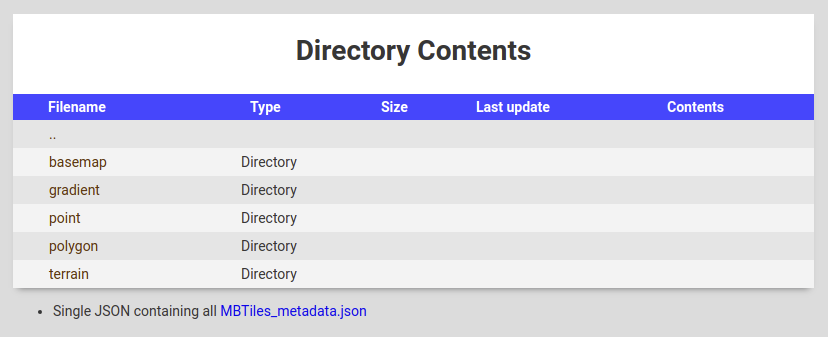

# resolver

[](https://travis-ci.org/Artsdatabanken/resolver)
[](https://coveralls.io/github/Artsdatabanken/resolver?branch=master)
[](https://github.com/ellerbrock/open-source-badges/)
[](https://opensource.org/licenses/mit-license.php)
[](CONTRIBUTING.md#pull-requests)
[](https://github.com/prettier/prettier)

[](https://maps.artsdatabanken.no)

Demo: [resolver](https://maps.artsdatabanken.no)

resolver maps from a url to a different url.

Example:

From: <https://artsdatabanken.no/Taxon/Canis%20lupus/48025>
To: <https://www.gbif.org/occurrence/map?q=Canis%20Lupus>

## Features

-

## Installation

```
npm install
npm start
```

Navigate to http://localhost:8000/

## Configuration

resolver has command-line options:

```
Usage: node resolver.js [options] [rootDirectory]

rootDirectory    Data directory containing resolver.json configuration file

Options:
   -p PORT --port PORT       Set the HTTP port [8000]

A root directory is required.
```

## Images

The following images are built for each resolver release, using the Node.js base image.

- Latest: https://hub.docker.com/r/artsdatabanken/resolver/

### Docker image

To use prebuilt docker image, navigate to a folder containing .mbtile file(s) and run

```
docker run -v ${pwd}:/data -p 8000:8000 artsdatabanken/resolver
```
